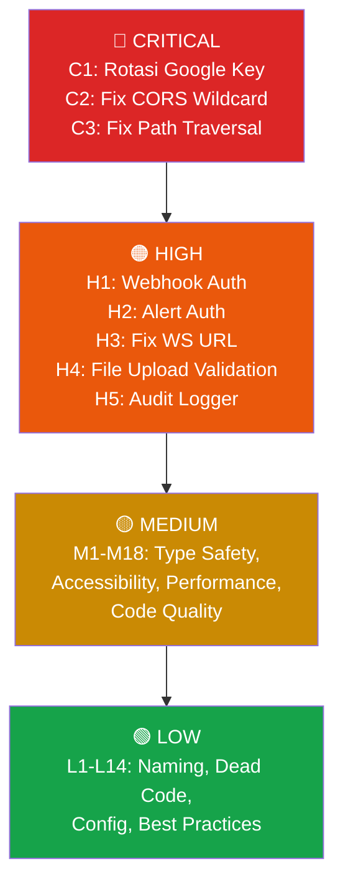

# 🔍 Laporan Evaluasi Komprehensif Kode — Dashboard Projects

**Project**: `dashboard-projects-sumbagteng`  
**Stack**: Next.js 16 + React 19 + SQLite (better-sqlite3) + TypeScript  
**Tanggal Review**: 25 Mei 2026  
**Total File Dianalisis**: ~65 file (API routes, lib, repositories, components, hooks, contexts, utils, types, configs)

---

## 📊 Ringkasan Temuan

| Severity | Jumlah | Keterangan |
|----------|--------|------------|
| 🔴 CRITICAL | 3 | Harus diperbaiki segera — potensi kebocoran data atau eksploitasi |
| 🟠 HIGH | 5 | Risiko tinggi — berpengaruh pada keamanan dan keandalan sistem |
| 🟡 MEDIUM | 18 | Perlu perbaikan — meningkatkan kualitas dan maintainability |
| 🟢 LOW | 14 | Saran peningkatan — meningkatkan kerapian dan best practice |

---

## 🔴 CRITICAL — Harus Diperbaiki Segera

### C1. File Credential Google (Private Key) Ada di Repository
**Kategori**: Security  
**File**: [kunci_rahasia_google.json](file:///d:/dashboard-projects/kunci_rahasia_google.json)

File ini berisi **private key lengkap** Google Service Account (`bot-olt@bot-olt.iam.gserviceaccount.com`) termasuk `private_key_id`, `private_key`, `client_email`, dan `client_id`.

> [!CAUTION]
> Meskipun file ini ada di `.gitignore` dan **belum pernah di-commit ke Git**, keberadaan private key plaintext di root project tetap berbahaya:
> - Jika `.gitignore` diubah secara tidak sengaja, key bisa ter-commit.
> - Siapapun yang punya akses ke mesin development bisa membaca file ini.
> - Jika project di-clone, file ini tidak ada dan app crash tanpa pesan yang jelas.

**Rekomendasi**:
1. **Rotasi key** di Google Cloud Console — anggap key saat ini compromised.
2. Gunakan **environment variable** untuk menyimpan credential, bukan file JSON.
3. Untuk production, gunakan **Workload Identity Federation** atau **Secret Manager**.
4. Tambahkan check di startup yang memberikan error message yang jelas jika credential tidak ada.

---

### C2. WebSocket CORS Origin Wildcard (`*`) 
**Kategori**: Security  
**File**: [websocket.ts](file:///d:/dashboard-projects/src/lib/websocket.ts#L29-L31)

```typescript
cors: {
  origin: '*', // Adjust for production
},
```

> [!CAUTION]
> CORS `origin: '*'` berarti **setiap website di internet** bisa membuat koneksi WebSocket ke server Anda. Attacker bisa:
> - Mengirim event palsu (`emit`) ke semua client yang terhubung
> - Melakukan DoS dengan membuka ribuan koneksi
> - Membaca data real-time yang dikirim melalui WebSocket

**Rekomendasi**:
```typescript
cors: {
  origin: process.env.NODE_ENV === 'production' 
    ? [process.env.NEXT_PUBLIC_APP_URL || 'http://localhost:3000']
    : '*',
  methods: ['GET', 'POST'],
},
```

---

### C3. Potensi Path Traversal pada File Storage
**Kategori**: Security  
**File**: [file-storage.ts](file:///d:/dashboard-projects/src/lib/file-storage.ts)

File storage membuat direktori dan menyimpan file berdasarkan input yang berasal dari user tanpa sanitasi path yang memadai. Attacker bisa menggunakan payload seperti `../../etc/sensitive` untuk mengakses atau menimpa file di luar direktori yang diizinkan.

**Rekomendasi**:
1. Validasi bahwa resolved path berada **di dalam** base directory menggunakan `path.resolve()` dan string comparison.
2. Tolak path yang mengandung `..`, `~`, atau absolute path.
3. Implementasi:
```typescript
function safePath(basePath: string, userPath: string): string {
  const resolved = path.resolve(basePath, userPath);
  if (!resolved.startsWith(path.resolve(basePath))) {
    throw new Error('Path traversal detected');
  }
  return resolved;
}
```

---

## 🟠 HIGH — Risiko Tinggi

### H1. Webhook Tanpa Verifikasi Signature
**Kategori**: Security  
**File**: `src/app/api/webhook/route.ts`

Endpoint webhook menerima request dari siapapun tanpa verifikasi. Tidak ada mekanisme HMAC signature, API key validation, atau IP whitelist.

**Rekomendasi**:
1. Tambahkan header verification (e.g. `X-Webhook-Secret`) yang dibandingkan dengan secret di `.env`.
2. Atau gunakan HMAC signature verification pada body request.

---

### H2. API Endpoint Alert Tanpa Autentikasi
**Kategori**: Security  
**File**: `src/app/api/alert/route.ts`

Endpoint `/api/alert` bisa dipanggil siapapun untuk mengirim alert WhatsApp ke group. Bisa disalahgunakan untuk spam.

**Rekomendasi**:
- Tambahkan middleware autentikasi (minimal API key di header).
- Tambahkan rate limiting (1 call per menit).

---

### H3. WebSocket URL Hardcoded di Client
**Kategori**: Security / Architecture  
**File**: [useWebSocket.ts](file:///d:/dashboard-projects/src/hooks/useWebSocket.ts#L19)

```typescript
const socketInstance = io('http://localhost:3001', { ... });
```

> [!WARNING]
> URL `localhost:3001` hardcoded berarti WebSocket **tidak akan bekerja di production** atau saat diakses dari device lain.

**Rekomendasi**:
```typescript
const wsUrl = process.env.NEXT_PUBLIC_WS_URL || 'http://localhost:3001';
const socketInstance = io(wsUrl, { ... });
```

---

### H4. Upload File Tanpa Validasi Content (Magic Bytes)
**Kategori**: Security  
**File**: `src/app/api/boq/route.ts`, `src/app/api/documents/route.ts`

Upload file hanya memvalidasi ekstensi (`.xlsx`, `.xls`) tapi **tidak memeriksa content type/magic bytes** file. Attacker bisa mengubah ekstensi file berbahaya.

**Rekomendasi**:
1. Periksa magic bytes file (e.g. `PK` untuk xlsx/zip, `D0 CF 11 E0` untuk xls/ole).
2. Set batas ukuran file di level middleware.
3. Implementasi content-type validation di server side.

---

### H5. Audit Logger Gagal Secara Silent
**Kategori**: Error Handling / Security  
**File**: [audit-logger.ts](file:///d:/dashboard-projects/src/lib/audit-logger.ts)

Jika audit log gagal ditulis (misalnya DB full atau error), error di-swallow secara silent. Artinya **aksi penting bisa terjadi tanpa tercatat**.

**Rekomendasi**:
1. Log error ke stderr/file fallback jika DB audit gagal.
2. Jangan gunakan try-catch kosong pada operasi audit — minimal `console.error`.
3. Pertimbangkan retry mechanism untuk audit log failures.

---

## 🟡 MEDIUM — Perlu Perbaikan

### M1. Duplikasi Pola Data Fetching di Halaman
**Kategori**: Code Smell / Best Practice  
**File**: Semua `page.tsx` di `src/app/(main)/`

Setiap halaman mengulangi pola yang sama: `useState` → `useEffect` → `fetch` → loading/error state. Ini menghasilkan banyak boilerplate yang duplikatif.

**Rekomendasi**: Buat custom hook `useApiQuery<T>(url)` yang mengenkapsulasi pola ini, atau gunakan library seperti `swr` / `react-query`:
```typescript
function useApiQuery<T>(url: string) {
  const [data, setData] = useState<T | null>(null);
  const [loading, setLoading] = useState(true);
  const [error, setError] = useState<string | null>(null);
  // ...fetch logic
  return { data, loading, error, refetch };
}
```

---

### M2. Magic Number pada Golive Target Validation
**Kategori**: Logic / Maintainability  
**File**: [sync-service.ts](file:///d:/dashboard-projects/src/lib/sync-service.ts#L125-L126)

```typescript
const currentDay = new Date().getDate();
if (currentDay > 10) {
  // Reject the change
}
```

Angka `10` adalah business rule yang tidak terdokumentasi. Tidak jelas mengapa tanggal 10 dipilih sebagai batas.

**Rekomendasi**:
1. Pindahkan ke constant dengan nama deskriptif: `const GOLIVE_TARGET_CHANGE_DEADLINE_DAY = 10;`
2. Tambahkan komentar yang menjelaskan business rule.
3. Idealnya, buat configurable melalui environment variable atau database config.

---

### M3. FormModal Tidak Accessible
**Kategori**: Accessibility  
**File**: [FormModal.tsx](file:///d:/dashboard-projects/src/components/ui/FormModal.tsx)

Modal tidak memiliki:
- `role="dialog"` dan `aria-modal="true"`
- Focus trapping (fokus bisa keluar modal via Tab)
- Handler `Escape` key untuk menutup modal
- `aria-labelledby` untuk judul modal

**Rekomendasi**:
- Tambahkan atribut ARIA yang sesuai.
- Implementasi focus trap menggunakan library seperti `focus-trap-react` atau custom implementation.
- Tambahkan keyboard handler untuk `Escape`.

---

### M4. ConfirmContext Dialog Tidak Accessible
**Kategori**: Accessibility  
**File**: [ConfirmContext.tsx](file:///d:/dashboard-projects/src/contexts/ConfirmContext.tsx)

Sama seperti M3, dialog konfirmasi tidak menangani aksesibilitas keyboard dan ARIA.

---

### M5. Static Repository Methods Menyulitkan Testing
**Kategori**: Architecture  
**File**: Semua file di `src/repositories/`

Semua repository menggunakan `static` methods yang langsung mengakses `db` global. Ini membuat:
- Unit testing sulit (tidak bisa mock database)
- Tidak bisa mengganti implementasi (e.g. untuk testing)

**Rekomendasi**:
- Pertimbangkan dependency injection pattern di masa depan.
- Minimal, buat interface untuk setiap repository agar bisa di-mock.

---

### M6. `any` Type di BoqRepository
**Kategori**: Type Safety  
**File**: [BoqRepository.ts](file:///d:/dashboard-projects/src/repositories/BoqRepository.ts#L230-L265)

```typescript
const params: any[] = [];
// ...
`).all(...params) as any[];
```

Penggunaan `any` menghilangkan type safety TypeScript.

**Rekomendasi**: Gunakan `string[]` untuk `params` dan definisikan proper return type interface.

---

### M7. `boq_items: z.array(z.unknown())` Tanpa Schema Spesifik
**Kategori**: Type Safety / Validation  
**File**: [validation.ts](file:///d:/dashboard-projects/src/lib/validation.ts#L65) dan [L102](file:///d:/dashboard-projects/src/lib/validation.ts#L102)

```typescript
boq_items: z.array(z.unknown()).optional().default([]),
```

Data BoQ items diterima tanpa validasi struktur. Ini berarti data rusak atau malicious bisa masuk ke database.

**Rekomendasi**: Definisikan Zod schema untuk BoQ item:
```typescript
const boqItemSchema = z.object({
  designator: z.string(),
  volume: z.number(),
  // ... field lainnya
});
boq_items: z.array(boqItemSchema).optional().default([]),
```

---

### M8. Module-Level Side Effects pada `db.ts`
**Kategori**: Architecture  
**File**: [db.ts](file:///d:/dashboard-projects/src/lib/db.ts#L22-L33)

Database connection dan migration terjadi saat module di-import. Ini menyulitkan testing dan bisa menyebabkan masalah saat hot-reload di development.

**Rekomendasi**: Gunakan lazy initialization:
```typescript
let _db: Database | null = null;
export function getDb(): Database {
  if (!_db) {
    _db = new Database(dbPath);
    _db.pragma('journal_mode = WAL');
    _db.pragma('foreign_keys = ON');
    initializeSchema(_db);
  }
  return _db;
}
```

---

### M9. Duplikasi Validasi Client-Server
**Kategori**: Code Duplication  
**File**: [src/utils/validation.ts](file:///d:/dashboard-projects/src/utils/validation.ts) vs [src/lib/validation.ts](file:///d:/dashboard-projects/src/lib/validation.ts)

Kedua file berisi validasi yang tumpang tindih. Perubahan di satu file harus di-sync manual ke file lainnya.

**Rekomendasi**: Pindahkan Zod schema ke shared directory (e.g. `src/schemas/`) yang bisa di-import oleh client maupun server.

---

### M10. Date Parsing Tidak Konsisten
**Kategori**: Logic Error  
**File**: [date.ts](file:///d:/dashboard-projects/src/utils/date.ts)

Campuran antara `date-fns` dan manipulasi tanggal manual. Beberapa fungsi tidak menangani edge case timezone secara konsisten.

**Rekomendasi**: Standardisasi menggunakan `date-fns` secara konsisten untuk semua operasi tanggal.

---

### M11. Tidak Ada Rate Limiting pada Sync Endpoint
**Kategori**: Security  
**File**: `src/app/api/sync/route.ts`

Endpoint sync memanggil Google Sheets API yang mempunyai quota limit. Tanpa rate limiting, endpoint bisa di-spam dan menghabiskan API quota.

**Rekomendasi**: Implementasi simple rate limiting (e.g. 1 sync per 60 detik).

---

### M12. Row Processing Tidak Efisien di Sync Service
**Kategori**: Performance  
**File**: [sync-service.ts](file:///d:/dashboard-projects/src/lib/sync-service.ts#L56-L168)

Setiap baris diproses secara sekuensial dengan individual database operations. Untuk dataset besar, ini bisa sangat lambat.

**Rekomendasi**: Gunakan batch insert/upsert dengan `db.transaction()` wrapper yang sudah ada, dan batch `prepare` statement di luar loop.

---

### M13. Seed OLT-ODC Tanpa Batch Insert
**Kategori**: Performance  
**File**: [seed-olt-odc.ts](file:///d:/dashboard-projects/src/lib/seed-olt-odc.ts)

Baris diproses satu per satu tanpa batch operation. Untuk data besar, ini sangat lambat.

**Rekomendasi**: Wrap operasi insert dalam transaction dan gunakan prepared statement di luar loop.

---

### M14. `webhookSchema` Kosong
**Kategori**: Code Smell  
**File**: [validation.ts](file:///d:/dashboard-projects/src/lib/validation.ts#L139-L140)

```typescript
export const webhookSchema = z.object({
});
```

Schema kosong yang tidak memvalidasi apapun. Ini bisa jadi incomplete implementation.

**Rekomendasi**: Definisikan schema yang sesuai atau hapus jika tidak digunakan.

---

### M15. Map Markers Tidak Di-cluster
**Kategori**: Performance  
**File**: Topology components (`TopologyMap.tsx`)

Untuk dataset besar, markers pada peta Leaflet tanpa clustering akan memperlambat rendering.

**Rekomendasi**: Gunakan `react-leaflet-markercluster` untuk mengelompokkan markers.

---

### M16. Beberapa Component Tanpa `useMemo`
**Kategori**: Performance  
**File**: Dashboard feature components

Beberapa komponen dashboard menghitung data turunan (derived data) di setiap render tanpa `useMemo`, meskipun input data tidak berubah.

**Rekomendasi**: Wrap komputasi mahal dalam `useMemo`:
```typescript
const processedData = useMemo(() => computeExpensiveData(rawData), [rawData]);
```

---

### M17. Database Type Safety — Penggunaan Boolean sebagai Integer
**Kategori**: Type Safety  
**File**: [database.ts](file:///d:/dashboard-projects/src/types/database.ts)

Field `golive_target_violated` di-type sebagai `number` (0/1) di TypeScript, tapi secara semantik ini adalah boolean. Ini bisa menyebabkan kebingungan.

**Rekomendasi**: Gunakan TypeScript branded type atau helper:
```typescript
golive_target_violated: 0 | 1;
// atau
isGoliveTargetViolated(): boolean { return this.golive_target_violated === 1; }
```

---

### M18. Export PDF Magic Numbers
**Kategori**: Code Smell  
**File**: [export-pdf.ts](file:///d:/dashboard-projects/src/lib/export-pdf.ts)

File berukuran 18KB dengan banyak magic numbers untuk positioning dan styling PDF. Sulit di-maintain.

**Rekomendasi**: Ekstrak konstanta layout ke objek konfigurasi terpisah:
```typescript
const PDF_LAYOUT = {
  margin: { top: 20, left: 14, right: 14 },
  headerHeight: 30,
  rowHeight: 8,
  fontSize: { title: 14, header: 8, body: 7 },
};
```

---

## 🟢 LOW — Saran Peningkatan

### L1. Inkonsistensi Penamaan File
**Kategori**: Naming Convention  
**File**: [parseExcel.ts](file:///d:/dashboard-projects/src/lib/parseExcel.ts) vs file lain yang menggunakan kebab-case

Sebagian besar file menggunakan `kebab-case.ts`, tapi `parseExcel.ts` menggunakan `camelCase`.

**Rekomendasi**: Rename ke `parse-excel.ts` untuk konsistensi.

---

### L2. Dead Code di `json.ts`
**Kategori**: Code Smell  
**File**: [json.ts](file:///d:/dashboard-projects/src/utils/json.ts)

Beberapa fungsi seperti `deepClone`, `mergeJsonObjects`, `extractFields`, `removeNullish`, `queryStringToObject` mungkin tidak digunakan di codebase.

**Rekomendasi**: Audit usage dan hapus fungsi yang tidak digunakan (tree-shaking tidak selalu menangkap ini di server-side).

---

### L3. Navigation Items Hardcoded di Layout
**Kategori**: Code Smell  
**File**: `src/app/(main)/layout.tsx`

Menu navigasi sidebar didefinisikan inline di komponen layout.

**Rekomendasi**: Pindahkan ke file konfigurasi terpisah (`src/config/navigation.ts`).

---

### L4. Toast Duration Hardcoded
**Kategori**: Code Smell  
**File**: [Toast.tsx](file:///d:/dashboard-projects/src/components/ui/Toast.tsx)

Durasi toast hardcoded 5000ms. Tidak bisa dikustomisasi per toast.

**Rekomendasi**: Terima `duration` sebagai prop opsional.

---

### L5. Migration ID Skip (18 → 20)
**Kategori**: Best Practice  
**File**: [migrations.ts](file:///d:/dashboard-projects/src/lib/migrations.ts#L710)

Migration IDs melompat dari 18 ke 20 (ID 19 tidak ada). Ini tidak menyebabkan bug, tapi bisa membingungkan developer.

**Rekomendasi**: Dokumentasikan alasannya di komentar, atau pastikan ID berurutan di migrasi berikutnya.

---

### L6. Tidak Ada Rollback Mechanism di Migrasi
**Kategori**: Best Practice  
**File**: [migrations.ts](file:///d:/dashboard-projects/src/lib/migrations.ts)

Migration hanya mendukung `up` (maju). Tidak ada `down` (rollback).

**Rekomendasi**: Untuk saat ini, cukup dokumentasikan bahwa rollback harus manual. Jika project berkembang, pertimbangkan migration framework seperti `umzug`.

---

### L7. Google Sheets Error Handling Tidak Berguna
**Kategori**: Error Handling  
**File**: [google-sheets.ts](file:///d:/dashboard-projects/src/lib/google-sheets.ts#L29-L32)

```typescript
} catch (error) {
  console.error('Error fetching sheet data:', error);
  throw error;
}
```

Pola `catch → log → rethrow` tidak menambah nilai. Error sudah akan di-log oleh caller.

**Rekomendasi**: Hapus try-catch atau tambahkan konteks yang berguna (e.g. retry logic, error wrapping).

---

### L8. Risk Thresholds Hardcoded
**Kategori**: Best Practice  
**File**: [risk-criteria.ts](file:///d:/dashboard-projects/src/lib/risk-criteria.ts)

Ambang batas risiko (hari untuk KRITIS/PERHATIAN) hardcoded.

**Rekomendasi**: Buat configurable melalui database config atau environment variable.

---

### L9. Sync Schedule Hardcoded
**Kategori**: Best Practice  
**File**: [sync-scheduler.ts](file:///d:/dashboard-projects/src/lib/sync-scheduler.ts)

Cron schedule tidak bisa diubah tanpa deploy ulang.

**Rekomendasi**: Buat configurable via environment variable: `SYNC_CRON_SCHEDULE=0 */6 * * *`.

---

### L10. Background Services Tanpa Graceful Shutdown
**Kategori**: Best Practice  
**File**: [background-services.ts](file:///d:/dashboard-projects/src/lib/background-services.ts)

Tidak ada mekanisme untuk menghentikan background services secara bersih saat server shutdown.

**Rekomendasi**: Registrasi handler `process.on('SIGTERM')` dan `process.on('SIGINT')` untuk menghentikan cron jobs.

---

### L11. `classifyStatus` Fragile String Matching
**Kategori**: Logic  
**File**: [project.ts](file:///d:/dashboard-projects/src/utils/project.ts)

Status classification bergantung pada string matching yang rapuh. Jika nama status berubah di Google Sheets, logika akan pecah.

**Rekomendasi**: Gunakan mapping object atau enum untuk status classification:
```typescript
const STATUS_CLASSIFICATION: Record<string, 'done' | 'progress' | 'cancelled'> = {
  '7. GOLIVE': 'done',
  '8. UJI TERIMA': 'done',
  '0. DROP': 'cancelled',
  // ...
};
```

---

### L12. Halaman Root Tanpa Metadata
**Kategori**: Best Practice / SEO  
**File**: [page.tsx](file:///d:/dashboard-projects/src/app/page.tsx)

Halaman root hanya melakukan redirect tanpa export metadata.

---

### L13. Report Logic di Components
**Kategori**: Code Smell  
**File**: Report feature components

Beberapa logika pembuatan laporan ada di dalam komponen React, bukan di utility function. Ini menyulitkan reuse dan testing.

**Rekomendasi**: Pisahkan logika bisnis ke utility/service function.

---

### L14. Month Name Array Duplikat
**Kategori**: Code Smell  
**File**: [dashboard-stats.ts](file:///d:/dashboard-projects/src/lib/dashboard-stats.ts#L112-L113)

```typescript
const monthNames = ['Jan', 'Feb', 'Mar', ... , 'Jan', 'Feb', 'Mar', ...];
```

Array menduplikasi nama bulan Indonesia dan Inggris dalam satu array datar. Ini fragile dan rawan bug.

**Rekomendasi**: Gunakan Map terpisah atau locale-based month parsing via `date-fns`.

---

## ✅ Hal Positif yang Sudah Baik

Beberapa aspek project ini sudah diimplementasikan dengan baik:

| Aspek | Detail |
|-------|--------|
| **Error Hierarchy** | Custom error classes (`AppError`, `ValidationError`, `NotFoundError`, dll.) di [errors.ts](file:///d:/dashboard-projects/src/lib/errors.ts) — sangat rapi |
| **API Response Pattern** | Konsisten dengan `successResponse`/`errorResponse`/`withErrorHandling` di [response.ts](file:///d:/dashboard-projects/src/lib/response.ts) |
| **Env Validation** | Validasi environment variable dengan Zod di [env.ts](file:///d:/dashboard-projects/src/lib/env.ts) — best practice |
| **Migration System** | Sistem migrasi database yang terstruktur dengan fase dan dokumentasi jelas di [migrations.ts](file:///d:/dashboard-projects/src/lib/migrations.ts) |
| **SQL Injection Prevention** | Semua query menggunakan parameterized statements (`?` placeholders) |
| **Git Ignore** | `.gitignore` sudah mencakup credential file, data directory, dan build artifacts |
| **Zod Schemas** | Validasi input server-side menggunakan Zod schema — konsisten dan typesafe |
| **Repository Pattern** | Pemisahan data access dari business logic yang jelas |
| **Transaction Usage** | Operasi multi-step menggunakan database transaction (e.g. BoQ upsert) |
| **Error Boundary** | React Error Boundary sudah diimplementasikan di [ErrorBoundary.tsx](file:///d:/dashboard-projects/src/components/ui/ErrorBoundary.tsx) |

---

## 🎯 Prioritas Aksi



> [!IMPORTANT]
> **Langkah pertama**: Segera tangani ketiga temuan CRITICAL (C1-C3), terutama C1 (rotasi Google credential) dan C2 (CORS wildcard). Ini adalah vulnerability yang bisa dieksploitasi jika aplikasi diakses dari jaringan publik.
