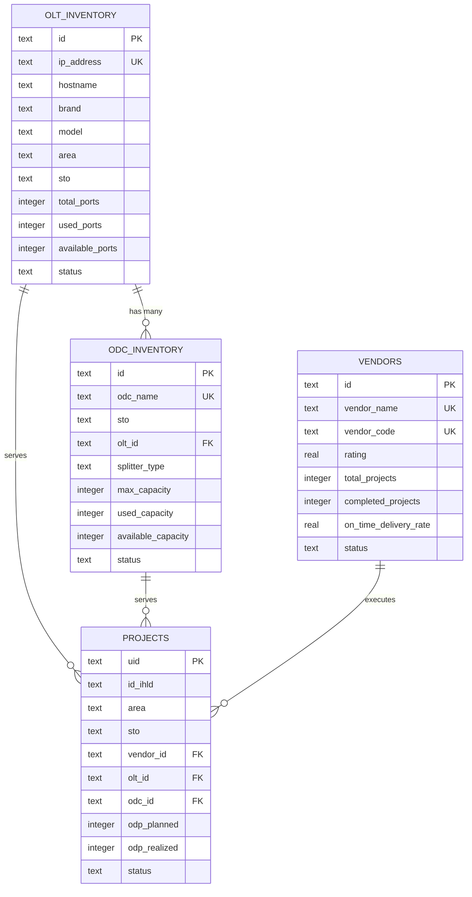
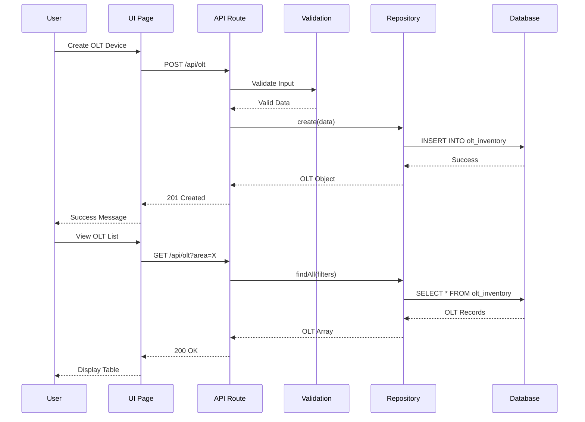
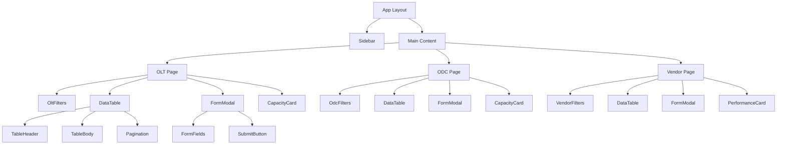
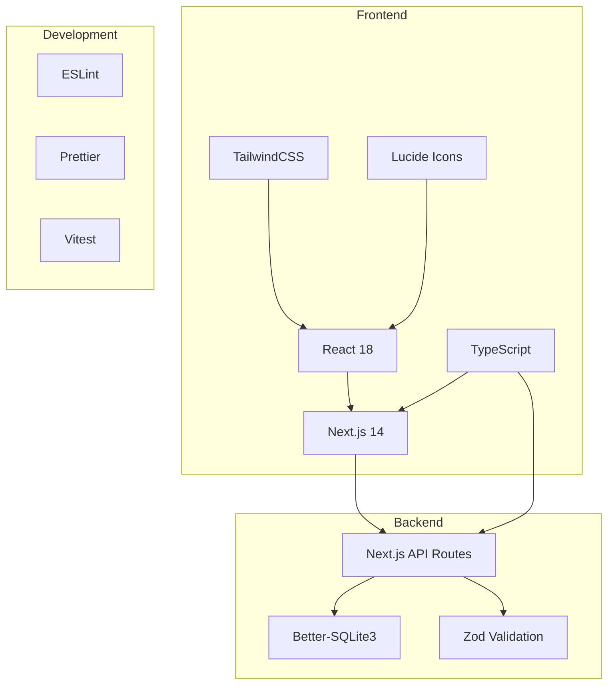
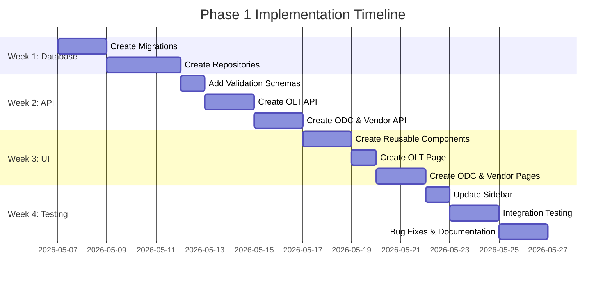

# Phase 1 Architecture Diagram

## System Architecture Overview

```mermaid
graph TB
    subgraph "Frontend Layer"
        UI1[OLT Inventory Page]
        UI2[ODC Inventory Page]
        UI3[Vendor Management Page]
        SB[Sidebar Navigation]
    end

    subgraph "Component Layer"
        DT[DataTable Component]
        FM[FormModal Component]
        CG[CapacityGauge Component]
        FC[Filter Components]
    end

    subgraph "API Layer"
        API1[/api/olt]
        API2[/api/odc]
        API3[/api/vendors]
    end

    subgraph "Repository Layer"
        REPO1[OltRepository]
        REPO2[OdcRepository]
        REPO3[VendorRepository]
    end

    subgraph "Database Layer"
        DB[(SQLite Database)]
        M1[Migration #4: OLT Table]
        M2[Migration #5: ODC Table]
        M3[Migration #6: Vendors Table]
        M4[Migration #7: Projects Enhancement]
    end

    subgraph "Validation Layer"
        V1[OLT Schema]
        V2[ODC Schema]
        V3[Vendor Schema]
    end

    UI1 --> DT
    UI1 --> FM
    UI1 --> CG
    UI2 --> DT
    UI2 --> FM
    UI2 --> CG
    UI3 --> DT
    UI3 --> FM

    UI1 --> API1
    UI2 --> API2
    UI3 --> API3

    API1 --> V1
    API2 --> V2
    API3 --> V3

    API1 --> REPO1
    API2 --> REPO2
    API3 --> REPO3

    REPO1 --> DB
    REPO2 --> DB
    REPO3 --> DB

    M1 --> DB
    M2 --> DB
    M3 --> DB
    M4 --> DB

    SB -.-> UI1
    SB -.-> UI2
    SB -.-> UI3
```

## Database Schema Relationships



## Data Flow Diagram



## Component Hierarchy



## API Endpoint Structure

```mermaid
graph LR
    A[/api] --> B[/olt]
    A --> C[/odc]
    A --> D[/vendors]
    
    B --> B1[GET - List All]
    B --> B2[POST - Create]
    B --> B3[/id]
    B --> B4[/stats]
    
    B3 --> B3A[GET - Get One]
    B3 --> B3B[PUT - Update]
    B3 --> B3C[DELETE - Delete]
    
    B4 --> B4A[GET - Statistics]
    
    C --> C1[GET - List All]
    C --> C2[POST - Create]
    C --> C3[/id]
    
    C3 --> C3A[GET - Get One]
    C3 --> C3B[PUT - Update]
    C3 --> C3C[DELETE - Delete]
    
    D --> D1[GET - List All]
    D --> D2[POST - Create]
    D --> D3[/id]
    
    D3 --> D3A[GET - Get One]
    D3 --> D3B[PUT - Update]
    D3 --> D3C[DELETE - Delete]
    D3 --> D3D[/performance]
    
    D3D --> D3D1[GET - Performance Metrics]
```

## File Structure

```
src/
├── app/
│   ├── (main)/
│   │   ├── olt/
│   │   │   └── page.tsx              # OLT Inventory Page
│   │   ├── odc/
│   │   │   └── page.tsx              # ODC Inventory Page
│   │   └── vendors/
│   │       └── page.tsx              # Vendor Management Page
│   └── api/
│       ├── olt/
│       │   ├── route.ts              # GET, POST /api/olt
│       │   ├── [id]/
│       │   │   └── route.ts          # GET, PUT, DELETE /api/olt/[id]
│       │   └── stats/
│       │       └── route.ts          # GET /api/olt/stats
│       ├── odc/
│       │   ├── route.ts              # GET, POST /api/odc
│       │   └── [id]/
│       │       └── route.ts          # GET, PUT, DELETE /api/odc/[id]
│       └── vendors/
│           ├── route.ts              # GET, POST /api/vendors
│           └── [id]/
│               ├── route.ts          # GET, PUT, DELETE /api/vendors/[id]
│               └── performance/
│                   └── route.ts      # GET /api/vendors/[id]/performance
├── components/
│   ├── features/
│   │   ├── olt/
│   │   │   ├── OltTable.tsx
│   │   │   ├── OltForm.tsx
│   │   │   └── OltFilters.tsx
│   │   ├── odc/
│   │   │   ├── OdcTable.tsx
│   │   │   ├── OdcForm.tsx
│   │   │   └── OdcFilters.tsx
│   │   └── vendors/
│   │       ├── VendorTable.tsx
│   │       ├── VendorForm.tsx
│   │       └── VendorPerformanceCard.tsx
│   ├── ui/
│   │   ├── DataTable.tsx             # Reusable table component
│   │   ├── FormModal.tsx             # Reusable modal component
│   │   └── CapacityGauge.tsx         # Capacity visualization
│   └── layout/
│       └── Sidebar.tsx               # Updated with new menu items
├── repositories/
│   ├── OltRepository.ts              # OLT CRUD operations
│   ├── OdcRepository.ts              # ODC CRUD operations
│   └── VendorRepository.ts           # Vendor CRUD operations
└── lib/
    ├── migrations.ts                 # Database migrations
    ├── validation.ts                 # Zod schemas
    └── db.ts                         # Database connection
```

## Technology Stack



## Implementation Phases



---

**Document Version**: 1.0  
**Created**: 2026-05-07  
**Status**: Architecture Design Complete